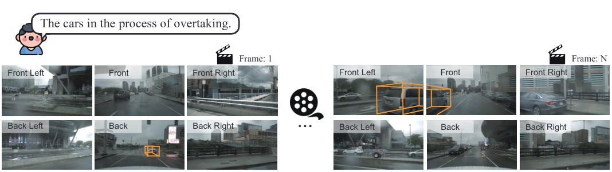

<div align="center">
<h1>
<b>
Language Prompt for Autonomous Driving
</b>
</h1>
</div>

> **[Language Prompt for Autonomous Driving](https://arxiv.org/abs/2309.04379)**
>
> [Dongming Wu*](https://wudongming97.github.io/), [Wencheng Han*](https://wencheng256.github.io/), [Tiancai Wang](https://scholar.google.com/citations?user=YI0sRroAAAAJ&hl=zh-CN), [Yingfei Liu](https://scholar.google.com/citations?user=pF9KA1sAAAAJ&hl=zh-CN&oi=ao), [Xiangyu Zhang](https://scholar.google.com/citations?user=yuB-cfoAAAAJ&hl=zh-CN), [Jianbing Shen](https://shenjianbing.github.io/)


## :fire: Introduction

<p align="center"></p>

This is the official implementation of **Language Prompt for Autonomous Driving**.
* We propose a new large-scale language prompt set for driving scenes, named NuPrompt.  As far as we know, it is the first dataset specializing in multiple 3D objects of interest from video domain. 
* We construct a new prompt-based driving perceiving task, which requires using a language prompt as a semantic cue to predict object trajectories.
* We develop a simple end-to-end baseline model, called PromptTrack, which effectively fuses cross-modal features in a newly built prompt reasoning branch to predict referent objects, showing impressive performance.

## :boom: News

- [2023.09.11] Our paper is released at [arXiv](https://arxiv.org/abs/2309.04379).

## :star: Benchmark

We expand Nuscenes dataset with annotating language prompts, named NuPrompt.
It is a large-scale dataset for language prompt in driving scenes, which contains 35,367 language prompts for 3D objects, each for an average of 5.3 instances.
Thanks to Nuscnes, our descriptions are closed to real-driving nature and complexity, covering a 3D, multi-view, and multi-frame space.

[//]: # (We show some examples below.)
[//]: # (More data will be released at future.)

## :eyes: Model

Our model is built upon [PF-Track](https://github.com/TRI-ML/PF-Track). 
We add a new prompt reasoning branch to predict the prompt-referred objects.
The code will be released at future.

## :point_right: Citation
If you find our work useful in your research, please consider citing it.

```
@article{wu2023language,
  title={Language Prompt for Autonomous Driving},
  author={Wu, Dongming and Han, Wencheng and Wang, Tiancai and Liu, Yingfei and Zhang, Xiangyu and Shen, Jianbing},
  journal={arXiv preprint},
  year={2023}
}
```


## :heart: Acknowledgements
We thank the authors that open the following projects. 
- [MMDetection3d](https://github.com/open-mmlab/mmdetection3d)
- [PF-Track](https://github.com/TRI-ML/PF-Track)
- [PETR](https://github.com/megvii-research/PETR)
- [MOTR](https://github.com/megvii-research/MOTR)


